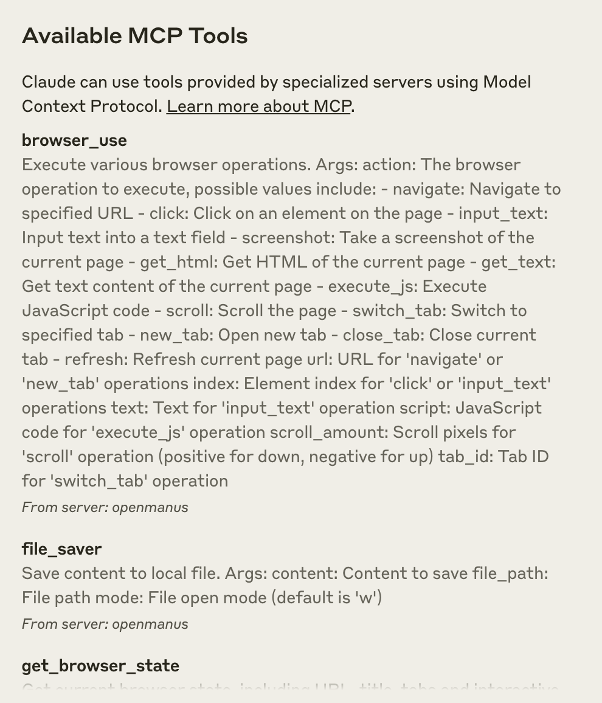

# OpenManus-server 🤖

This project provides a server based on [Model Context Protocol (MCP)](https://modelcontextprotocol.io/) that exposes **OpenManus** tool functionalities as standardized APIs.

## ✨ Features

This MCP server provides access to the following OpenManus tools:

1. **Browser Automation** 🌐 - Navigate webpages, click elements, input text, and more
2. **Google Search** 🔍 - Execute searches and retrieve result links
3. **Python Code Execution** 🐍 - Run Python code in a secure environment
4. **File Saving** 💾 - Save content to local files
5. **Termination Control** 🛑 - Control program execution flow

## 🚀 Installation

### Prerequisites

- Python 3.10+
- OpenManus project dependencies

### Installation Steps

1. First, install the OpenManus project:

```bash
git clone https://github.com/mannaandpoem/OpenManus.git
cd OpenManus
```

2. Install dependencies:

```bash
# Using uv (recommended)
curl -LsSf https://astral.sh/uv/install.sh | sh
uv venv
source .venv/bin/activate  # Unix/macOS
# or .venv\Scripts\activate  # Windows
uv pip install -r requirements.txt
```

3. Install MCP dependencies:

```bash
uv pip install -r openmanus_server/mcp_requirements.txt
```

## Demo display
https://github.com/user-attachments/assets/177b1f50-422f-4c2e-ab7d-1f3d7ff27679

## 📖 Usage

### 1. Testing your server with Claude for Desktop 🖥️

> ⚠️ **Note**: Claude for Desktop is not yet available on Linux. Linux users can build an MCP client that connects to the server we just built.

#### Step 1: Installation Check ✅
First, make sure you have Claude for Desktop installed. [You can install the latest version here](https://claude.ai/download). If you already have Claude for Desktop, **make sure it's updated to the latest version**.

#### Step 2: Configuration Setup ⚙️
We'll need to configure Claude for Desktop for this server you want to use. To do this, open your Claude for Desktop App configuration at `~/Library/Application Support/Claude/claude_desktop_config.json` in a text editor. Make sure to create the file if it doesn't exist.

```bash
vim ~/Library/Application\ Support/Claude/claude_desktop_config.json
```

#### Step 3: Server Configuration 🔧
You'll then add your servers in the `mcpServers` key. The MCP UI elements will only show up in Claude for Desktop if at least one server is properly configured.

In this case, we'll add our single Openmanus server like so:
```json
{
    "mcpServers": {
        "openmanus": {
            "command": "/ABSOLUTE/PATH/TO/PARENT/FOLDER/uv",
            "args": [
                "--directory",
                "/ABSOLUTE/PATH/TO/OpenManus/openmanus_server",
                "run",
                "openmanus_server.py"
            ]
        }
    }
}
```

> 💡 **Tip**: You may need to put the full path to the uv executable in the command field. You can get this by running:
> - MacOS/Linux: `which uv`
> - Windows: `where uv`

#### Step 4: Understanding the Configuration 📝
This tells Claude for Desktop:
1. There's an MCP server named "openmanus" 🔌
2. To launch it by running `uv --directory /ABSOLUTE/PATH/TO/OpenManus/openmanus_server run openmanus_server.py` 🚀

#### Step 5: Activation 🔄
Save the file, and restart Claude for Desktop.

#### Step 6: Verification ✨
Let's make sure Claude for Desktop is picking up the six tools we've exposed in our `openmanus` server. You can do this by looking for the hammer icon 


After clicking on the hammer icon, you should see tools listed:


#### Ready to Test! 🎉
**Now, you can test the openmanus server in Claude for Desktop**:
* 🔍 Try to find the recent news about Manus AI agent, and write a post for me!


### 💻 2. Testing with simple Client Example

Check out `openmanus_client_example.py` to test the openmanus server using the MCP client.

```
uv run openmanus_server/openmanus_client_example.py openmanus_server/openmanus_server.py
```


## 🔒 Security Considerations

- When using in production, ensure proper authentication and authorization mechanisms are in place
- The Python execution tool has timeout limits to prevent long-running code

## 📄 License

Same license as the OpenManus project
